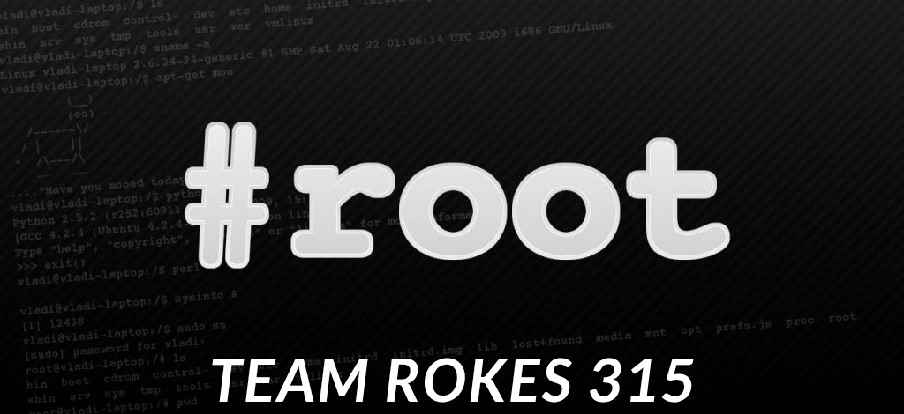

# ⚙️ localroot-server

**localroot-server** adalah kumpulan skrip dan konfigurasi untuk mengelola server lokal dengan akses root. Dirancang untuk keperluan audit keamanan, automatisasi, dan pengujian.

---

## 🔍 Fitur

- 🚀 Akses root lokal otomatis
- 🔐 Penguatan sistem (hardening)
- 🔄 Manajemen user & permission
- 🧪 Skrip bypass otentikasi (testing)
- 📁 Kontrol file & konfigurasi sistem

---

## telegram ☎️ @seotampanidaman

```bash
sudo bash scripts/main.sh
